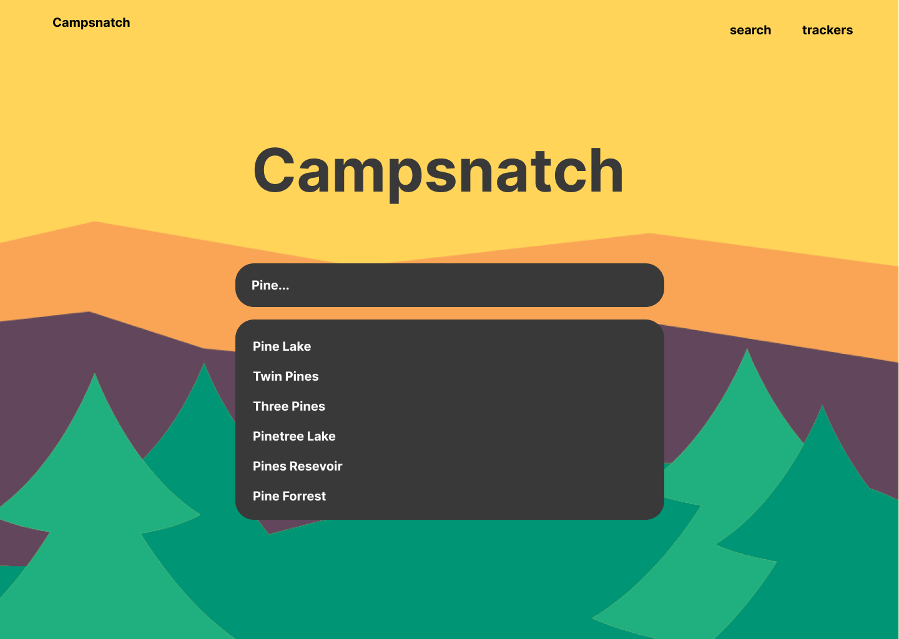
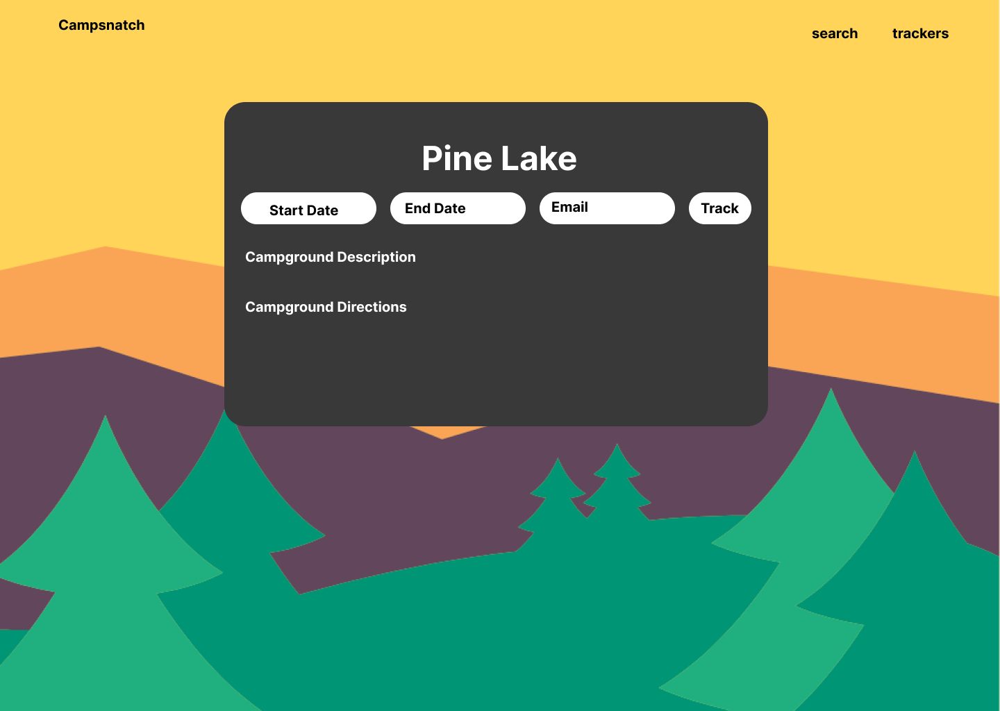
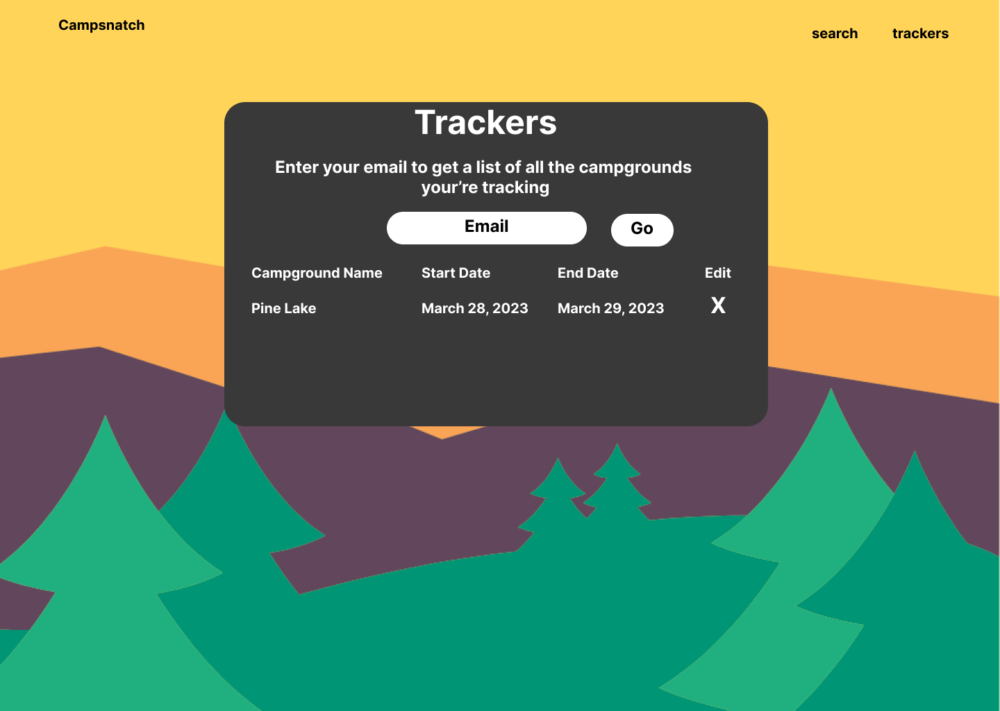

# Campsnatch - A Camping Tourism Solution
#### CS260 Startup Deliverable

## Elevator Pitch
Millions of Americans plan camping vacations across the United States each year. Campsnatch is a website that helps campers get notifications when campgrounds become available in their desired camping destinations. Campsnatch leverages the recreation.gov apis to scan for campsite availabilities.

## Key Features
* Search for thousands of campgrounds across the America
* Get detailed information about campgrounds including amentities, alerts, activities, and directions 
* Set up a tracker to enable notifications for a certain campground
* View and edit list of enabled trackers for campgrounds.

## Web Programming Notes
### Table element
* The html table element can produce a table grid structure to format rows and columns of data
* thead stand for table heading
* tr stands for table row
* td stands for table data
* tbody stands for table body
#### Example below
<table>
    <caption>Alien football stars</caption>
    <tr>
        <th scope="col">Player</th>
        <th scope="col">Gloobles</th>
        <th scope="col">Za'taak</th>
    </tr>
    <tr>
        <th scope="row">TR-7</th>
        <td>7</td>
        <td>4,569</td>
    </tr>
    <tr>
        <th scope="row">Khiresh Odo</th>
        <td>7</td>
        <td>7,223</td>
    </tr>
    <tr>
        <th scope="row">Mia Oolong</th>
        <td>9</td>
        <td>6,219</td>
    </tr>
</table>

### CSS Notes
Use frameworks like tailwinds and bootstrap to leverage their design components. This allows you to not have to start from scratch.
Style sheets are connected up in the head of the html document by using "link rel="stylesheet" href="styles.css""

### JS Notes
localstorage allows you to set persistent properties in the browser
window.location.href = "url" lets you jump pages in the javascript file
document.querySelectorAll allows you to grab all items with a class name
document.querySelectore('.classname') allow you to grab a class name
audio files can be played with the Audio constructor and the play property

### JS Debug
Nodemon
Once you start writing complex web applications you will find yourself making changes in the middle of debugging sessions and you would like have node restart automatically and update the browser as the changes are saved. This seems like a simple thing, but over the course of hundreds of changes, every second you can save really starts to add up.

The Nodemon package is basically a wrapper around node that watches for files in the project directory to change. When it detects that you saved something it will automatically restart node.

If you would like to experiment with this then take the following steps. First install Nodemon globally so that you can use it to debug all of your projects.

npm install -g nodemon
Then, because VS Code does not know how to launch nodemon automatically, you need create a VS Code launch configuration. In VS Code press CTRL-SHIFT-P (on Windows) or ⌘-⇧-P (on Mac) and type the command Debug: Add configuration. This will then ask you what type of configuration you would like to create. Type Node.js and select the Node.js: Nodemon setup option. in the launch configuration file at it creates, change the program from app.js to main.js (or whatever the main JavaScript file is for your application) and save the configuration file.

Now when you press F5 to start debugging it will run Nodemon instead of Node.js and your changes will automatically update your application when you save.
